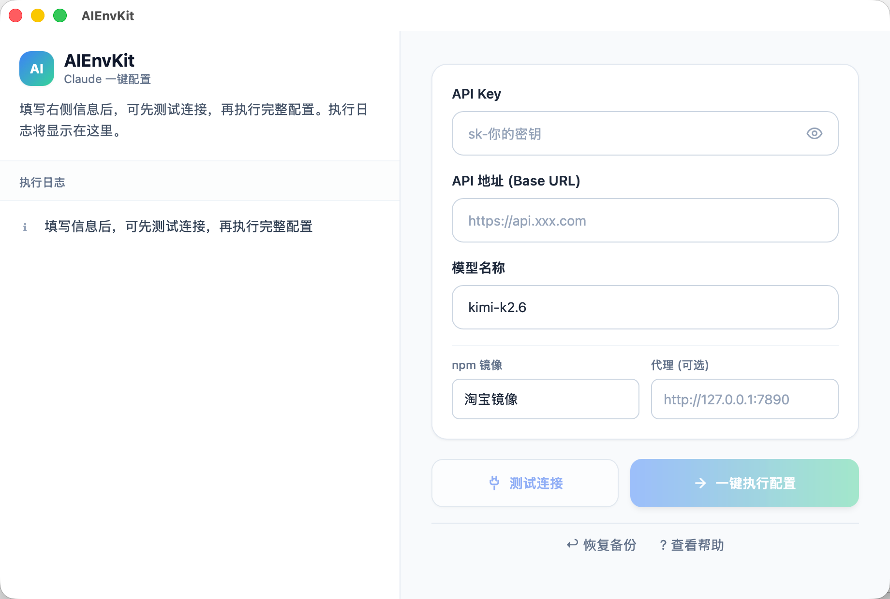

# AIEnvKit

AI 模型环境一键配置工具，面向普通用户。下载一个文件，双击打开，填写 3 项信息，先测试连接，再一键完成 Claude Code 环境配置。

---

## 目录

- [下载安装](#下载安装)
- [快速开始](#快速开始)
  - [DeepSeek 配置示例](#deepseek-配置示例)
  - [代理使用特别提示](#代理使用特别提示)
- [功能特性](#功能特性)
- [界面预览](#界面预览)
- [开发构建](#开发构建)
- [目录结构](#目录结构)
- [安全与隐私](#安全与隐私)
- [许可证](#许可证)

---

## 下载安装

> 以下地址来自 [GitHub Releases](https://github.com/xtxiaolu/AIEnvKit/releases)，请根据自己的系统选择对应版本下载。

### macOS

| 平台 | 下载文件 | 说明 |
|---|---|---|
| Apple Silicon (M1/M2/M3/M4) | [AIEnvKit_0.1.0_macOS_Apple_Silicon.zip](https://github.com/xtxiaolu/AIEnvKit/releases/download/v0.1.0/AIEnvKit_0.1.0_macOS_Apple_Silicon.zip) | 下载后解压，将 `AIEnvKit.app` 拖入「应用程序」文件夹 |
| Intel (x86_64) | [AIEnvKit_0.1.0_macOS_Intel.zip](https://github.com/xtxiaolu/AIEnvKit/releases/download/v0.1.0/AIEnvKit_0.1.0_macOS_Intel.zip) | 下载后解压，将 `AIEnvKit.app` 拖入「应用程序」文件夹 |

> **macOS 首次打开提示**：若系统提示「无法打开」或「来自身份不明的开发者」，请前往「系统设置 → 隐私与安全性」，点击「仍要打开」。正式分发版本建议进行 Apple 开发者签名。

### Windows

| 平台 | 下载文件 | 说明 |
|---|---|---|
| Windows 10/11 (x64) | [AIEnvKit_0.1.0_Windows_x64_Setup.exe](https://github.com/xtxiaolu/AIEnvKit/releases/download/v0.1.0/AIEnvKit_0.1.0_Windows_x64_Setup.exe) | 下载后双击安装，按向导完成即可 |

> **Windows 首次运行提示**：若提示「Windows 已保护你的电脑」，请点击「更多信息」→「仍要运行」。安装包当前未签名，首次运行时会自动引导安装 WebView2（如尚未安装）。

---

## 快速开始

打开应用后，**只需要配置下面三个输入框**，其他选项保持默认即可：

| 输入框 | 说明 | 示例（DeepSeek） |
|---|---|---|
| **API Key** | 你的 API 密钥 | `sk-xxxxxxxxxxxxxxxxxxxxxxxxxxxxxxxx`（请填写你自己的 Key） |
| **API 地址 (Base URL)** | API 服务地址 | `https://api.deepseek.com` |
| **模型名称** | 要使用的模型 | `deepseek-v4-pro` |

操作步骤：

1. 填入 **API Key**、**API 地址**、**模型名称**。
2. 点击 **「测试连接」**，确认返回连接成功。
3. 点击 **「一键执行配置」**，等待配置完成。

### DeepSeek 配置示例

如果你想接入 DeepSeek，按下面填写即可：

- **API 地址**：`https://api.deepseek.com`
- **模型名称**：`deepseek-v4-pro`
- **API Key**：这里填写你自己的 Key

### ⚠️ 代理使用特别提示

- **没有梯子（VPN/代理）的用户请不要填写「代理」字段**，保持为空即可。
- 「代理」仅用于已经拥有可用 HTTP/HTTPS 代理的用户，常见示例：`http://127.0.0.1:7890`。
- 如果测试连接失败，请先检查 API Key、API 地址、模型名称是否填写正确；确认无误后再考虑是否需要代理。

### 一键配置会写入的内容

配置成功后会写入 Claude Code 的配置文件，并在系统环境变量中设置同名变量：

```json
{
  "env": {
    "ANTHROPIC_AUTH_TOKEN": "你的 API Key",
    "ANTHROPIC_BASE_URL": "你的 API 地址",
    "ANTHROPIC_MODEL": "模型名称",
    "ANTHROPIC_DEFAULT_SONNET_MODEL": "模型名称",
    "ANTHROPIC_DEFAULT_HAIKU_MODEL": "模型名称",
    "CLAUDE_CODE_SUBAGENT_MODEL": "模型名称"
  }
}
```

配置位置：

- macOS：`~/.claude/settings.json` + shell profile
- Windows：`%USERPROFILE%\.claude\settings.json` + PowerShell profile / 用户环境变量

---

## 功能特性

### 1. 一键执行配置

点击「一键执行配置」后，应用会按顺序完成：

1. **环境检测**：Node.js、npm、Claude Code CLI、网络
2. **安装/升级 Claude Code CLI**：支持 npm 镜像与代理设置
3. **备份原配置**：自动备份 `settings.json` 和 shell/PowerShell profile
4. **写入 Claude Code 配置**：写入 `~/.claude/settings.json` 或 `%USERPROFILE%\.claude\settings.json`
5. **设置环境变量**：ANTHROPIC_AUTH_TOKEN、ANTHROPIC_BASE_URL、ANTHROPIC_MODEL
6. **最终验证**：测试 API 连接是否可用

### 2. 一键安装 Node.js

当系统未安装 Node.js 时，应用提供一键安装：

- **镜像选择**：官方 / 淘宝镜像（npmmirror，国内推荐）/ 腾讯镜像
- **代理支持**：可填写 HTTP/HTTPS 代理地址
- **安装位置**：
  - macOS：`~/.aienvkit/node`
  - Windows：`%USERPROFILE%\.aienvkit\node`
- **PATH 处理**：安装完成后自动加入后续配置脚本的 PATH，并在 shell profile / PowerShell profile 中持久化

### 3. 测试连接

只发送一次 API 请求到 `/models`，不修改任何配置，用于确认填写的信息是否正确。

### 4. 恢复备份

每次执行配置前会自动备份：

- macOS：`~/.aienvkit/backups/`
- Windows：`%USERPROFILE%\.aienvkit\backups\`

点击界面底部「恢复备份」可还原最近一次的 settings.json 和 shell profile。

---

## 界面预览



- 窗口固定尺寸：480 × 680
- 顶部：Logo + 标题 + 引导语
- 中部：API Key / API 地址 / 模型名称 输入框
- 高级选项：npm 镜像 / 代理地址（可选，方便国内网络环境）
- 按钮：测试连接（次要）、一键执行配置（主按钮）
- 底部：实时执行日志 + 恢复备份 / 查看帮助

---

## 开发构建

### 开发环境要求

- [Node.js](https://nodejs.org/) 18+
- [Rust](https://www.rust-lang.org/tools/install) 1.75+
- Tauri 系统依赖（见 [Tauri 官方文档](https://v2.tauri.app/start/prerequisites/)）

### 开发命令

```bash
# 安装依赖
npm install

# 开发模式（热重载）
npm run tauri:dev

# 构建生产版（当前平台）
npm run tauri:build
```

### 分平台打包

```bash
# macOS Intel (x86_64)
npm run tauri:build:mac-x64

# macOS Apple Silicon (arm64)
npm run tauri:build:mac-arm64

# Windows（需要 Windows 环境或交叉编译工具链）
npm run tauri:build
```

产物位置：

```
src-tauri/target/x86_64-apple-darwin/release/bundle/macos/AIEnvKit.app
src-tauri/target/aarch64-apple-darwin/release/bundle/macos/AIEnvKit.app
src-tauri/target/x86_64-pc-windows-msvc/release/bundle/nsis/AIEnvKit_0.1.0_x64-setup.exe
```

---

## 目录结构

```
AIEnvKit/
├── src/                    # Vue 3 前端
│   ├── App.vue
│   ├── components/
│   │   ├── FormCard.vue
│   │   ├── InstallNodeModal.vue
│   │   ├── LogPanel.vue
│   │   └── StatusButton.vue
│   ├── main.ts
│   ├── style.css
│   └── types.ts
├── src-tauri/              # Rust 后端
│   ├── src/main.rs
│   ├── Cargo.toml
│   ├── tauri.conf.json
│   ├── capabilities/
│   └── icons/              # 应用图标资源
├── scripts/                # 跨平台配置脚本
│   ├── macos/
│   │   ├── set-env.sh
│   │   ├── install-node.sh
│   │   └── restore-backup.sh
│   └── windows/
│       ├── set-env.ps1
│       ├── install-node.ps1
│       └── restore-backup.ps1
├── docs/                   # 文档图片占位目录
│   └── screenshot.png
├── package.json
├── vite.config.ts
├── tailwind.config.js
└── README.md
```

---

## 安全与隐私

- API Key 仅存储在本地 `~/.claude/settings.json` 和环境变量中，不会上传到任何服务器。
- 每次重新配置前会自动备份原配置，避免误操作导致配置丢失。
- 正式分发 macOS 版本建议进行 Apple 开发者账号签名，否则用户会看到安全提示。

---

## 许可证

MIT
